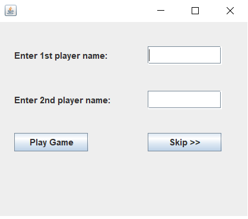
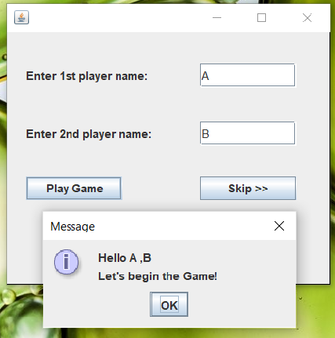
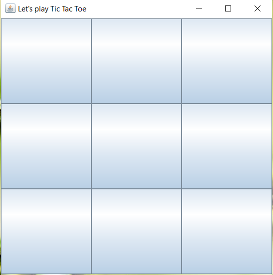
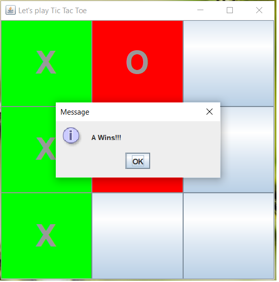
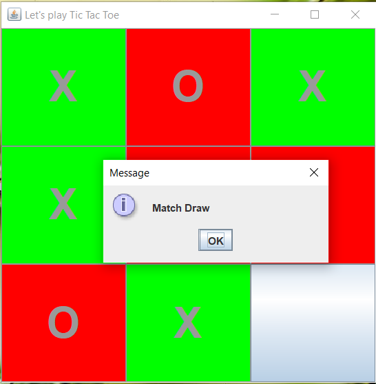
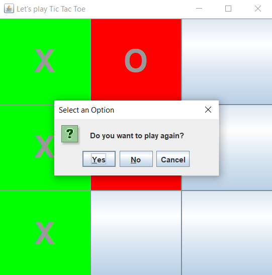
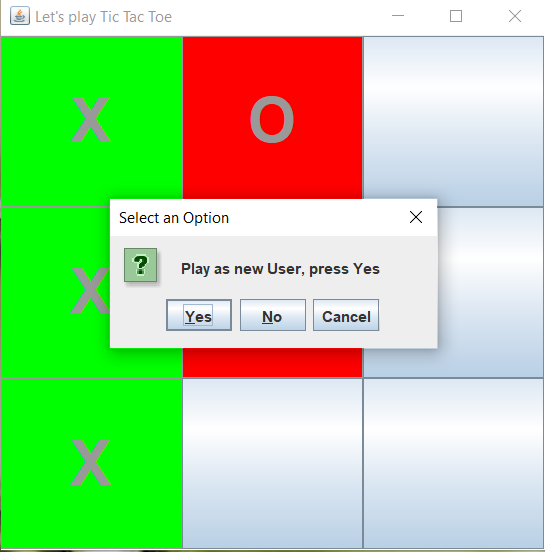

# TicTacToe-Game

The project allows 2 players to play the game, or a single player can play as anonymous player.

<b> ScreenShots </b>
 
 1.)  Firstly, players are asked to enter their names or player can skip the details and directly start the game   
        
 2.)  When players enter their name, then they get a welcome message to start game   
         
 3.)  Game screen is displayed  
         
 4.)  First player makes the move as 'X' and second player as 'O', upon winning his/her name is displayed  
          
 5.)  If its a draw then Match Draw message is declared  
           
 6.)  If player wishes to restart, then following Dialog box is shown    
        
 7.)  If player chooses No - screen is closed, for Yes - player is asked to play as new player or continue as present player   
         
 8.)  If player clicks Yes then Frame '1' is shown else Frame '3' is shown  
 9.)  In any Dialog box, if player clicks 'Cancel' then game is freezed.      
 10.) When player clicks on Skip button in frame '1' then he/she may start the game, Frame '3' is shown to begin the game 
 11.) Please note the project is attached with a Runnable Jar File, you can execute it directly to play the game! 
 
 
